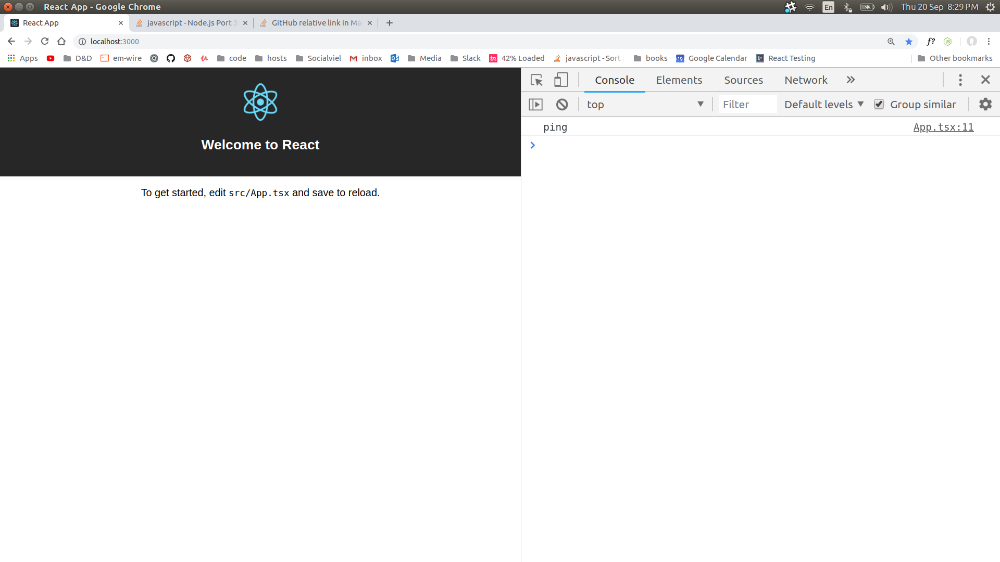

# react-express-ts-starter
This is a quick boilerplate for use with my React-Typescript-Express Apps.

# Quickstart
Clone The Repo
```
git clone git@github.com:BrooklinJazz/react-express-ts-starter.git
```

## Change The Server Port (default 2345)
change the proxy so that react sends the request to the express server correctly
```js
// react-express/package.json
// change the proxy value and change localhost:<desired-port-number>
"proxy": "http://localhost:2345"
```

```js
// react-express/server/bin/www
// change the "2345" string to be your desired port
var port = normalizePort(process.env.PORT || "2345");
```
## start the client and server
this project uses nodemon so that the server will restart when changes are made.
```js
// yarn
yarn dev
// npm
npm run dev
```

## open localhost:3000 in your browser
if the server is connected with the client properly you should see a ping test log in the console


If you don't want this behavior you can simply remove the componentDidMount function in App.tsx
```js
public componentDidMount() {
    fetch('/ping')
        .then(res => res.text())
        // tslint:disable-next-line no-console
        .then(ping => console.log(ping));
}
```